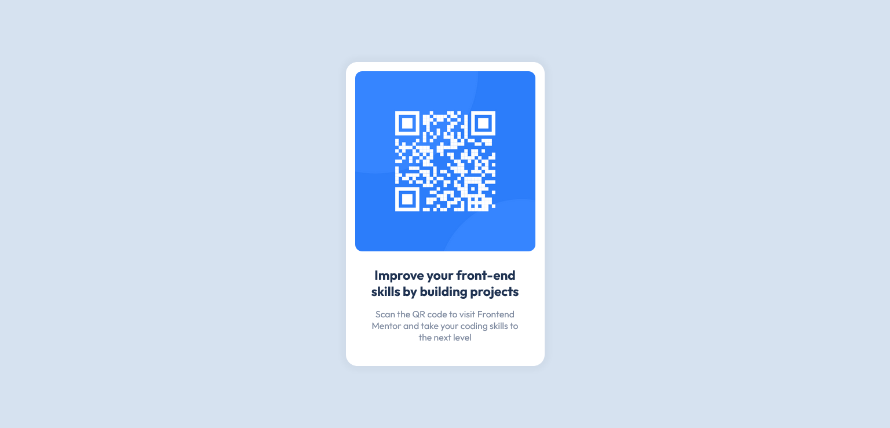

# Frontend Mentor - QR code component solution

This is a solution to the [QR code component challenge on Frontend Mentor](https://www.frontendmentor.io/challenges/qr-code-component-iux_sIO_H). Frontend Mentor challenges help you improve your coding skills by building realistic projects. 

### Screenshot

### Links

- Solution URL: [Frontend Mentor Solution Preview](https://your-solution-url.com)
- Live Site URL: [Live Preview](https://sridhardnesh.github.io/qr-code-component/)

### Built with

- HTML5
- CSS custom properties
- Mobile-first workflow

### What I learned

I used this challenge to reinforce my learnings with practice. I brushed up my CSS a little bit and had fun in doing it from scratch.

## Author

- Website - [Sridhar](https://github.com/SridharDnesh)
- Frontend Mentor - [@SridharDnesh](https://www.frontendmentor.io/profile/SridharDnesh)
- Twitter - [@SridharDnesh](https://www.twitter.com/SridharDnesh)
